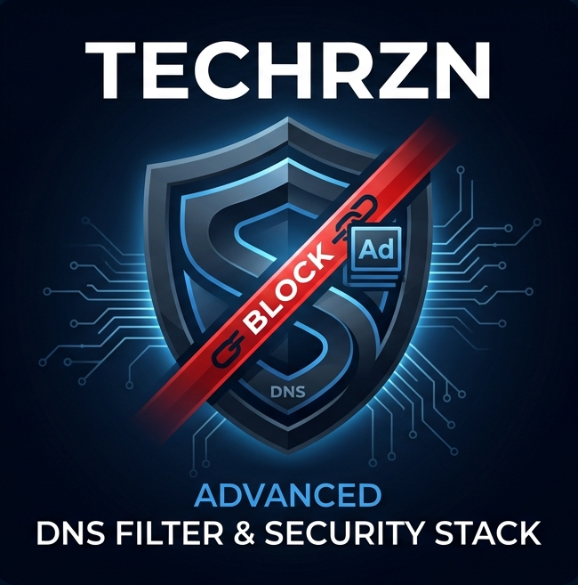

 

  

  
  
  

---

## 🛰️ System Architecture & Mission
**High-Performance Blocklists • Updated Daily • 100% Cleaned**

Welcome to the **TechRZN Filter Hub**. This repository provides a daily updated "All-in-One" blocklist for **AdGuard Home, Pi-hole, and Technitium**. All lists are automatically deduplicated and checked against a multi-stage whitelist to ensure maximum security with zero latency.

---

## 🚀 THE MASTER LIST (Recommended)
**The ultimate solution for your setup. Contains all 14 filter modules in a single file.**

  

`https://raw.githubusercontent.com/TechRZN-DNS/TechRZN-Blocklist-Collection/main/combined_blocklist.txt`

---

## 🧩 Modular Filter Architecture (The 14 Modules)
| Module | Focus / Protection Area | Raw Link |
| :--- | :--- | :--- |
| 🥇 **HaGeZi Pro** | Global All-in-One Protection (Gold Standard) | [Link](https://raw.githubusercontent.com/TechRZN-DNS/TechRZN-Blocklist-Collection/main/lists/hagezi_pro.txt) |
| 🔐 **Bypass Filter** | VPN, Proxy, Tor & Bypass Methods | [Link](https://raw.githubusercontent.com/TechRZN-DNS/TechRZN-Blocklist-Collection/main/lists/hagezi_bypass.txt) |
| 🏴‍☠️ **Threat Intel** | Protection against Cyber Attacks & Botnets | [Link](https://raw.githubusercontent.com/TechRZN-DNS/TechRZN-Blocklist-Collection/main/lists/hagezi_threat.txt) |
| 🇩🇪 **German Filter** | **Special Optimization for DE / AT / CH** | [Link](https://raw.githubusercontent.com/TechRZN-DNS/TechRZN-Blocklist-Collection/main/lists/adguard_german.txt) |
| 📺 **Smart TV** | Prevents TV Tracking & Advertising | [Link](https://raw.githubusercontent.com/TechRZN-DNS/TechRZN-Blocklist-Collection/main/lists/smart_tv.txt) |
| 🦠 **URLHaus** | Malware URLs & Phishing (Real-time) | [Link](https://raw.githubusercontent.com/TechRZN-DNS/TechRZN-Blocklist-Collection/main/lists/urlhaus_malicious.txt) |
| 💻 **Windows Spy** | Hardening for MS Telemetry & Office | [Link](https://raw.githubusercontent.com/TechRZN-DNS/TechRZN-Blocklist-Collection/main/lists/hagezi_windows.txt) |
| 🎮 **Gambling** | Blocking of Gambling & Betting Sites | [Link](https://raw.githubusercontent.com/TechRZN-DNS/TechRZN-Blocklist-Collection/main/lists/hagezi_gambling.txt) |
| ⚠️ **Fake DNS** | Protection against Scams & Fake Shops | [Link](https://raw.githubusercontent.com/TechRZN-DNS/TechRZN-Blocklist-Collection/main/lists/hagezi_fake.txt) |
| 📜 **Dan Pollock** | Legendary Hosts File Classic | [Link](https://raw.githubusercontent.com/TechRZN-DNS/TechRZN-Blocklist-Collection/main/lists/dan_pollock.txt) |
| 📍 **TechRZN IPs** | Custom List of Malicious IP Addresses | [Link](https://raw.githubusercontent.com/TechRZN-DNS/TechRZN-Blocklist-Collection/main/lists/techrzn_ips.txt) |
| 🛍️ **Anti-Fakeshop** | Defense against Scam Shops & Subs (RPiList) | [Link](https://raw.githubusercontent.com/TechRZN-DNS/TechRZN-Blocklist-Collection/main/lists/notserious.txt) |
| 🏦 **Banking Protect** | Phishing Shield (DE/AT/CH Banks - RPiList) | [Link](https://raw.githubusercontent.com/TechRZN-DNS/TechRZN-Blocklist-Collection/main/lists/phishing_de.txt) |
| 🔬 **Fake Science** | Blocks Predatory Publishers & Scam Portals (RPiList) | [Link](https://raw.githubusercontent.com/TechRZN-DNS/TechRZN-Blocklist-Collection/main/lists/fake_science.txt) |

---

## 🏗️ The Backbone: Bare-Metal Power
*Every list is processed and validated on this dedicated infrastructure in Kleve.*

<table align="center" width="100%" style="border-collapse: collapse; background-color: #0d1117; border-radius: 10px; overflow: hidden;">
  <tr>
    <td align="left" width="50%" style="padding: 15px; border: 1px solid #30363d;">
      <code>CORE NODE</code> <b>UGREEN NAS DXP4800 Plus</b> <img src="
