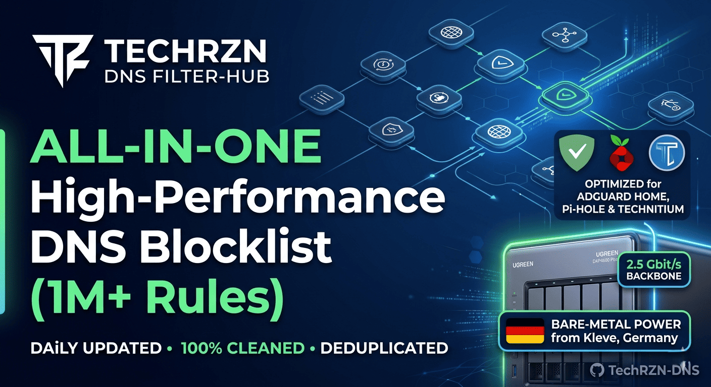

 

  

  Sprache: 🇩🇪 <b>[Deutsch]</b> | 🇺🇸 <a href="README.en.md">[English]</a>

  
  
  

---

## 🛰️ Mission & Vision
> **High-Performance Blocklisten • Täglich aktualisiert • 100% Bereinigt**

Willkommen beim **TechRZN Filter-Hub**. Dieses Repository bietet eine hochoptimierte "All-in-One" Lösung für **AdGuard Home, Pi-hole und Technitium**. Durch automatisierte Deduplizierung und eine intelligente Whitelist garantieren wir Schutz ohne "Overblocking".

---

## ❤️ Support & Community
Wenn dir der **TechRZN Filter-Hub** hilft, dein Netzwerk sicherer zu machen, freue ich mich über deine Unterstützung auf Patreon!

  
   
  
  

---

## 🚀 Direkt-Einbindung (Schnellzugriff)
> **All-in-One Lösung:** Aufgrund der massiven Größe (>100MB) ist die Master-Liste nun in zwei Teile aufgeteilt. **Bitte abonniere beide Teile**, um den vollen Schutz zu erhalten.

  
  &nbsp;&nbsp;
  

<b>📦 Was steckt in der Master-Liste? (Inhaltsverzeichnis)</b>

 

| Modul | Schutzwirkung | Icon |
| :--- | :--- | :---: |
| **TechRZN Tracking** | Stoppt Datensammler (Windows, Android, iOS, Smart-TV). | 📱 |
| **TechRZN Ads** | Blockiert aggressive Werbenetzwerke & Popups. | 🚫 |
| **TechRZN Malware** | Sperrt C2-Server und Schadsoftware-Quellen. | 🛡️ |
| **TechRZN Phishing** | Abwehr von Fake-Logins und Scam-Seiten. | 🔑 |
| **TechRZN Fakeshops** | Sperrt bekannte Betrugsshops & Abofallen. | 🛒 |
| **TechRZN Squatting** | Blockiert Imitate bekannter Markennamen. | 🔍 |
| **TechRZN IPs** | DNS-Sperre für bösartige IP-Adressen. | 🖥️ |
| **TechRZN Threat Intel**| Schutz vor aktiven Botnetzen & Angriffswellen. | 🛑 |
| **TechRZN Gambling** | Blockiert Casinos, Wetten & Lootboxen. | 🎰 |
| **TechRZN Crypto** | Stoppt Browser-Miner & Krypto-Scams. | 🪙 |
| **TechRZN Dating** | Unterbindet Zugriff auf Partnerbörsen. | ❤️ |
| **TechRZN Spam** | Filtert aggressive Mail-Tracker & Spam-Domains. | 📧 |
| **TechRZN Bypass** | Verhindert VPN/Proxy-Umgehungen im Netzwerk. | 🔓 |

  

---

## 🔞 Jugendschutz & Adult-Content (Optional)
> [!WARNING]
> **Bewusste Trennung:** Die folgenden Listen sind **NICHT** in der Master-Liste enthalten. Wir haben uns dazu entschieden, diese separat anzubieten, um "Overblocking" zu vermeiden und jedem Nutzer die Wahl zu lassen, ob er diese strikten Filter aktivieren möchte.

  
  &nbsp;&nbsp;
  

* **TechRZN Porn:** Umfassende Sperre von expliziten Inhalten, Erotik-Portalen und Adult-Ads.
* **TechRZN Jugendschutz:** Strenger Filter für Family-Safety (Gewalt, Drogen, jugendgefährdende Seiten).

---

> [!IMPORTANT]
> **Der TechRZN Performance-Vorteil:** Würdest du alle Quellen einzeln einbinden, müsste dein System über **5,5 Millionen** Einträge verwalten. Die TechRZN-Engine filtert Redundanzen und Dubletten heraus, sodass nur **~2,2 Millionen hocheffektive Regeln** übrig bleiben.
> **Ergebnis:** Maximaler Schutz bei ca. **60% weniger Systemlast** und spürbar schnelleren DNS-Antwortzeiten.

---

## 🛠️ Eigene TechRZN Spezial-Module
*Diese Listen werden direkt in Kleve handkuratiert und auf maximale Präzision optimiert.*

| Status | Modul | Fokus & Schutzwirkung | Link |
| :---: | :--- | :--- | :---: |
| 🛡️ | **TechRZN Ads** | **Werbe-Schild:** Werbenetzwerke und Tracker. | [🔗](https://raw.githubusercontent.com/TechRZN-DNS/TechRZN-Blocklist-Collection/main/blocklists/techrzn_ads.txt) |
| 🕵️‍♂️ | **TechRZN Tracking** | **Tracking:** Blockierung von Telemetrie. | [🔗](https://raw.githubusercontent.com/TechRZN-DNS/TechRZN-Blocklist-Collection/main/blocklists/techrzn_tracking.txt) |
| 🦠 | **TechRZN Malware** | **Virenabwehr:** Sperrt Schadsoftware & C2-Server. | [🔗](https://raw.githubusercontent.com/TechRZN-DNS/TechRZN-Blocklist-Collection/main/blocklists/techrzn_malware.txt) |
| 🎣 | **TechRZN Phishing** | **Betrugsschutz:** Fake-Logins und Scam-Seiten. | [🔗](https://raw.githubusercontent.com/TechRZN-DNS/TechRZN-Blocklist-Collection/main/blocklists/techrzn_phishing.txt) |
| 🛑 | **TechRZN Threat Intel** | **Bedrohungsabwehr:** Botnetze und Cyberangriffe. | [🔗](https://raw.githubusercontent.com/TechRZN-DNS/TechRZN-Blocklist-Collection/main/blocklists/techrzn_threat_intel.txt) |
| 🛍️ | **TechRZN Fakeshops** | **Einkaufsschutz:** Betrugsshops und Scam-Angebote. | [🔗](https://raw.githubusercontent.com/TechRZN-DNS/TechRZN-Blocklist-Collection/main/blocklists/techrzn_fakeshops.txt) |
| 🏠 | **TechRZN Squatting** | **Tippfehler-Schutz:** Imitate bekannter Markennamen. | [🔗](https://raw.githubusercontent.com/TechRZN-DNS/TechRZN-Blocklist-Collection/main/blocklists/techrzn_domain_squatting.txt) |
| 🎰 | **TechRZN Gambling** | **Spielerschutz:** Sperrt Casinos und Wettanbieter. | [🔗](https://raw.githubusercontent.com/TechRZN-DNS/TechRZN-Blocklist-Collection/main/blocklists/techrzn_gambling.txt) |
| 🪙 | **TechRZN Crypto** | **Krypto-Schild:** Blockiert Miner und Krypto-Betrug. | [🔗](https://raw.githubusercontent.com/TechRZN-DNS/TechRZN-Blocklist-Collection/main/blocklists/techrzn_crypto.txt) |
| ❤️ | **TechRZN Dating** | **Dating-Filter:** Zugriff auf Partnerbörsen. | [🔗](https://raw.githubusercontent.com/TechRZN-DNS/TechRZN-Blocklist-Collection/main/blocklists/techrzn_dating.txt) |
| 📧 | **TechRZN Spam** | **Spam-Schutz:** Filtert aggressive Marketing-Domains. | [🔗](https://raw.githubusercontent.com/TechRZN-DNS/TechRZN-Blocklist-Collection/main/blocklists/techrzn_spam.txt) |
| 🧪 | **TechRZN Fake Science** | **Wahrheits-Check:** Pseudo-Wissenschaft & Fake-News. | [🔗](https://raw.githubusercontent.com/TechRZN-DNS/TechRZN-Blocklist-Collection/main/blocklists/techrzn_fake_science.txt) |
| 🔓 | **TechRZN Bypass** | **Tunnel-Block:** VPN- und Proxy-Umgehungen. | [🔗](https://raw.githubusercontent.com/TechRZN-DNS/TechRZN-Blocklist-Collection/main/blocklists/techrzn_bypass.txt) |

---

## 🛠️ Einrichtung & Optimierung

<b>📖 Schritt-für-Schritt Installation (AdGuard & Pi-hole)</b>

 
<blockquote>
<h3>🛡️ AdGuard Home</h3>
1. Gehe zu <b>Filter</b> ➔ <b>DNS-Sperrlisten</b>. 
2. Klicke auf <b>Sperrliste hinzufügen</b> ➔ <b>Benutzerdefinierte Liste</b>. 
3. Füge <b>Teil 1</b> und dann <b>Teil 2</b> als separate Listen hinzu. 

<h3>🥧 Pi-hole</h3>
1. Gehe zu <b>Adlists</b> im linken Menü. 
2. Füge beide URLs (Teil 1 & 2) nacheinander ein. 
3. <b>Wichtig:</b> Führe unter <i>Tools</i> ➔ <i>Update Gravity</i> ein Update aus.
</blockquote>

<b>⚙️ Optimale AdGuard Home Einstellungen (Empfohlen)</b>

 
<blockquote>
Für maximale Performance bei 2M+ Regeln (getestet auf <b>UGREEN NAS / 2,5 Gbit/s</b>):  
<b>1. DNS-Cache & TTL</b> 
* Cache-Größe: <code>104.857.600</code> (100 MB) 
* Optimistisches Caching: <b>Aktiviert</b> ✅ 
* TTL-Minimalwert: <code>3600</code> (1 Stunde) 
* TTL-Höchstwert überschreiben: <code>84600</code> (24 Stunden) ✅  
<b>2. Sicherheit & Filterung</b> 
* DNSSEC: <b>Aktiviert</b> ✅ 
* Sperrmodus: <code>Null-IP</code> 
* Upstream-Timeout: <code>2</code> Sek. ⚡ 
* Gültigkeitsdauer blockierter Antwort: <code>300</code> Sek.
</blockquote>

---

## 🏗️ Hardware Backbone (Kleve, Deutschland)
*Validierung auf Enterprise-Hardware für absolute Zuverlässigkeit.*

<table align="center" width="100%" style="border-collapse: collapse; background-color: #0d1117; border-radius: 12px; overflow: hidden; border: 1px solid #30363d;">
  <tr>
    <td align="left" style="padding: 20px;">
      <b>CORE NODE</b> UGREEN NAS DXP4800 Plus 
      
    </td>
    <td align="left" style="padding: 20px;">
      <b>BESCHLEUNIGUNG</b> 2x Samsung 990 Pro RAID 
      
    </td>
  </tr>
  <tr>
    <td align="left" style="padding: 20px;">
      <b>NETZWERK</b> 2.5 Gbit Hybrid-Power 
      
    </td>
    <td align="left" style="padding: 20px;">
      <b>SPEICHER</b> 80 TB WD Red Pro (12G SAS) 
      
    </td>
  </tr>
</table>

---

## ⚖️ Lizenz & Copyright
Dieses Projekt ist unter der **MIT-Lizenz** lizenziert – siehe die [LICENSE](LICENSE) Datei für Details.
 
**Copyright (c) 2026 Jörg Berns (TechRZN) • Kleve, Deutschland.**

## 🙏 Danksagung & Quellen
Dieses Projekt basiert auf der wertvollen Arbeit von: **HaGeZi**, **RPiList**, **AdGuard Team** und **Abuse.ch**.

**Stand: März 2026**
 

